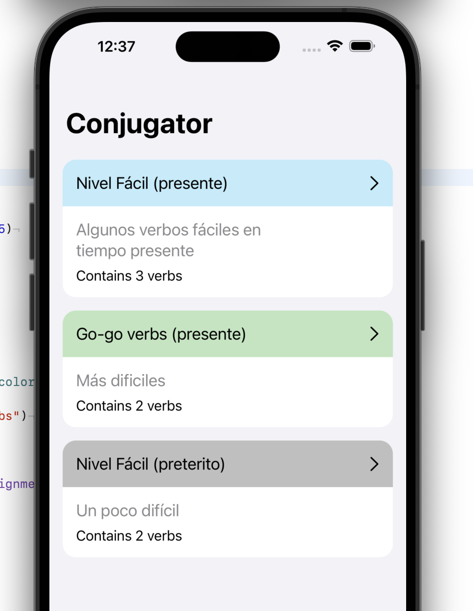

# Conjugator

Conjugator is a game that helps students learn the different forms of Spanish verbs. It was initially proposed by the Spanish teacher at our school, then brought to life through our wonderful Coding Club.

It is built in Swift and SwiftUI, targeting a minimum of iOS 15.

Data source: https://docs.google.com/spreadsheets/d/1t-onBgRP5BSHZ26XjvmVgi6RxZmpKO7RBI3JARYE3Bs/edit#gid=0

## Specifications

### Level Configuration

All the levels are stored in individual text files (this is to make it easy on the people creating them, as they have little to no programming experience), with three metadata properties. These properties are the name of the level, a brief description, and an colour in hexadecimal form (without a leading `#`, see the example below for more info). A screenshot showing these properties in action is below.



Following the properties are the verbs. The infinitive of the verb is listed first, followed by a colon, then the forms in the specific order of yo, tú, él/ella/usted, nosotros/nosotras, vosotros/vosotras, and finally ellos/ellas/ustedes. At least two verbs must be in a level for it to be recognized. An example level file is below.

```text
Nivel Fácil (presente)
Algunos verbos fáciles en tiempo presente
FF0000
comer: como, comes, come, comemos, coméis, comen
beber: bebo, bebes, bebe, bebemos, bebéis, beben
andar: ando, andas, anda, andamos, andáis, andan
```

### Internal Specification

Once the app processes the level files, it converts them into native Swift `struct` objects. The app has two structs for the levels: `Level` and `Challenge`. `Level` is the main object and has the aforementioned three properties, as well as an array of `Challenge` objects, which are the verb forms. The `Challenge` struct has two properties: the infinitive (as a `String`) and the forms (as a `[String]`).

```swift
struct Level {
    struct Challenge {
        var verb: String = ""

        /**
        Should be of length 6 and contain forms for **yo, tú, él/ella/usted, nosotros/nosotras, vosotros/vosotras, and ellos/ellas/ustedes**
        */
        var forms: [String] = []
    }

    var title: String = ""
    var description: String = ""
    var colorHex: Int? = nil
    /// There should be at least two challenges
    var challenges: [Challenge] = []
}
```
